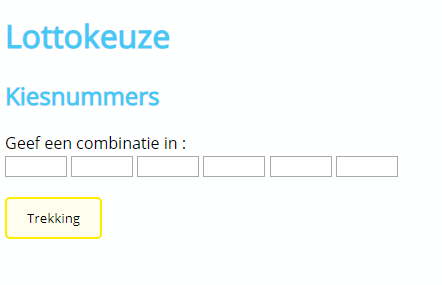
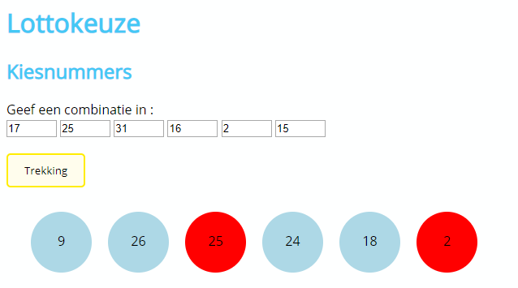
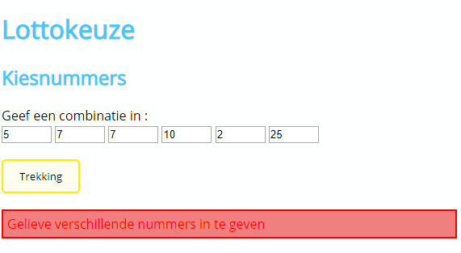

# oe-array-objecten-lotto
Exercise on Arrays (Javascript)

## Opdracht
De volgende oefening simuleert een lottotrekking, waarbij de gebruiker de kans krijgt zijn winnende nummers in te geven via de daartoe voorziene inputvelden.

Na de keuze klik je op de knop trekking en zie je de lottocijfers, welke random worden gekozen, de nummers die overeenkomen met je keuze krijgen een andere achtergrondkleur.

Werk deze toepassing uit en zorg voor de correcte foutmeldingen wanneer :
- De gebruiker geen geldige nummers ingeeft (tussen 0 en 44).
- De gebruiker lege velden laat in zijn combinatie
- Zorg er tevens voor dat de getrokken lottocijfers verschillend zijn, door hiervoor een correct algoritme te bedenkeen

## Uitbreidingen
- Voorzie een extra veldje 'Beschikbare inzet', die je default op 100 plaatst.
- Iedere trekking kost je 5 Euro
- Bij winst wordt je winst opgeteld bij dit bedrag :

 Aantal correcte cijfers | winst
 ----------------------- | -----
 2  | 2 Euro
 3 | 10 Euro
 4 | 50 Euro
 5 | 500 Euro
 6 | 2000 Euro

